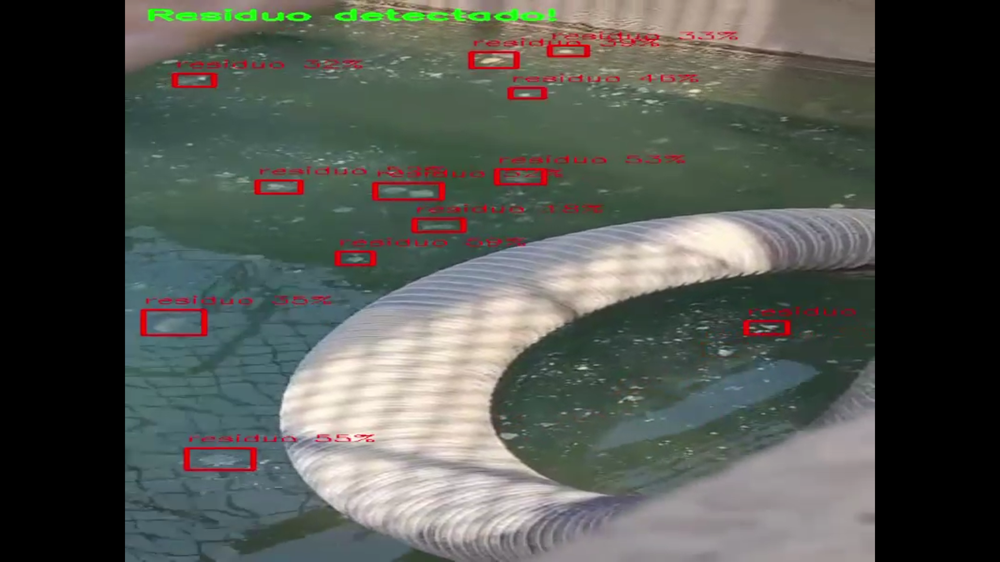
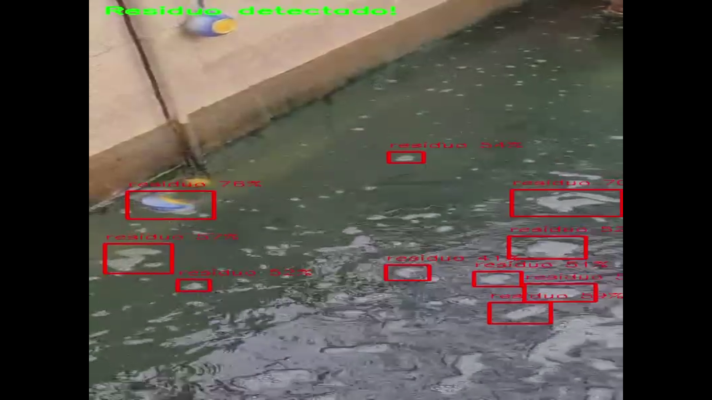

# 💧 Water Treatment Monitoring - Michelin

> **Industrial Computer Vision for Residue & Foam Detection**

This project utilizes a custom-trained **YOLOv8 Object Detection model** to automate the quality monitoring of the water treatment system at a Michelin factory.

The system analyzes real-time video feeds from the water tanks to detect and localize **residues and excess foam**, enabling faster response times for the treatment stations and preventing overflow or filtration issues.

---

## 🎯 Results

The model is capable of distinguishing between clean water turbulence and actual residue accumulation. Below are examples of the detection in action:

  
  

  <b>✅ Residue/Foam Detected</b> &nbsp;&nbsp;&nbsp;&nbsp;&nbsp;&nbsp;&nbsp;&nbsp;&nbsp;&nbsp;&nbsp;&nbsp;&nbsp;&nbsp;&nbsp; <b>✅ Monitoring in Progress</b>

---

## ⚙️ Project Overview

Manual inspection of water treatment systems can be intermittent and prone to delays. This automated solution ensures 24/7 monitoring efficiency.

### 1. The Challenge
Michelin's industrial water process requires strict control. Excess foam or solid residues can indicate chemical imbalances or filter saturation. The goal was to replace periodic human checks with continuous AI surveillance.

### 2. Custom Dataset
A specific dataset was collected directly from the factory's water basins under various lighting and weather conditions.
* **Target Class:** `residue` / `foam`
* **Annotation:** Bounding boxes were used to mark areas of accumulation.

### 3. Model Training 🚀
The model was trained using the **YOLOv8** architecture within a **Google Colab** environment (Tesla T4 GPU).
* **Optimization:** Techniques such as Data Augmentation (brightness, exposure adjustments) were applied to handle the reflective nature of water and outdoor lighting changes.
* **Performance:** The model achieves high confidence detection even in turbulent water conditions.

---

## 🛠️ Technologies Used

* 
* 
* 
* 

---
